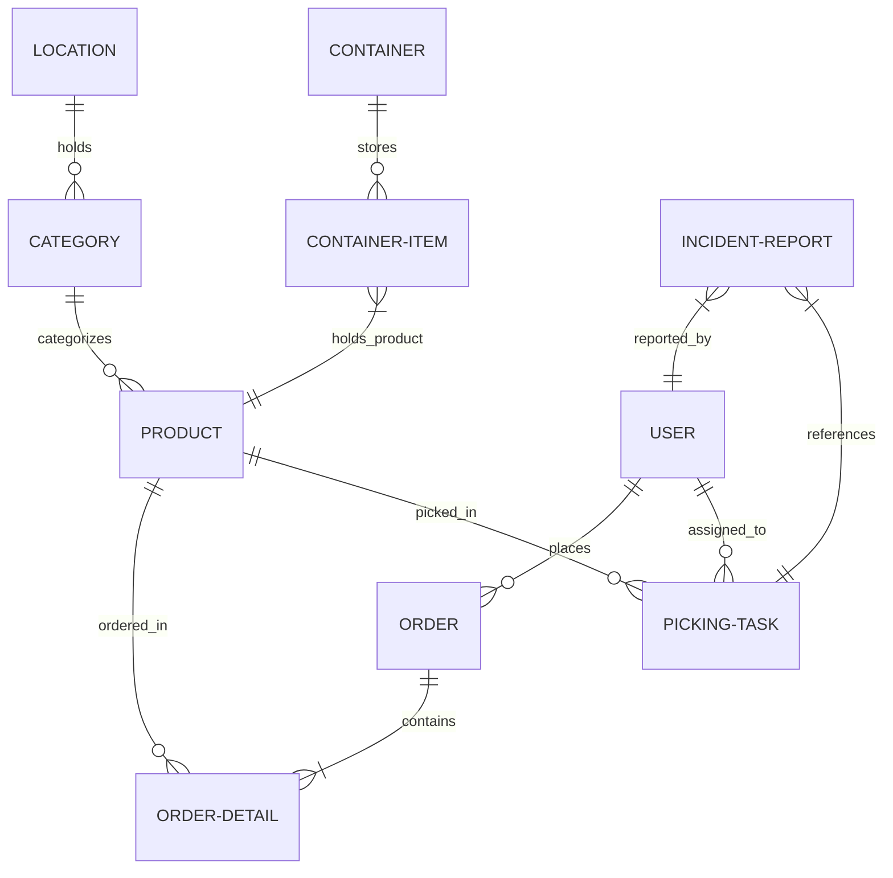
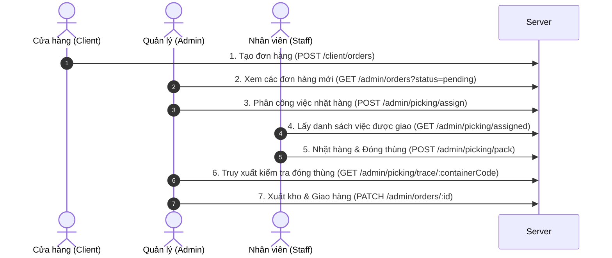

# 📘 CẨM NANG TÍCH HỢP API CHO NHÀ PHÁT TRIỂN FRONTEND
> **Dự án:** Hệ thống Quản lý Đơn hàng & Kho vận KingFoods (KingFoods Order & Picking WMS)  
> **Phiên bản:** 1.0.0 (Bản hoàn thiện)  
> **Cập nhật mới nhất:** 2026-05-07

Tài liệu này được viết chi tiết từ đầu đến cuối nhằm hỗ trợ đội ngũ Frontend dễ dàng nắm bắt kiến trúc hệ thống, các mối liên kết dữ liệu giữa các bảng và cách tích hợp tất cả các API một cách trực quan, chính xác nhất.

---

## 🗺️ 1. SƠ ĐỒ QUAN HỆ BẢNG (DATABASE SCHEMA RELATIONSHIP)

Để xây dựng giao diện chính xác, Frontend cần hiểu rõ cách các thực thể liên kết chéo với nhau:



### 🔗 Giải thích liên kết dữ liệu:
1. **User (Người dùng):** Có 3 vai trò chính: `client` (Chi nhánh đặt hàng), `staff` (Nhân viên kho nhặt hàng), và `admin` (Quản lý kho).
2. **Order (Đơn hàng) & OrderDetail:** 
   * Khi cửa hàng (`client`) đặt hàng, hệ thống tạo bản ghi `Order` chứa `customerId` liên kết tới `User` (bảng `branches`).
   * Các mặt hàng nằm trong đơn hàng được lưu chi tiết trong bảng `OrderDetail` (`order_id`, `product_id`, `quantity`, `price`).
3. **Product $\rightarrow$ Category $\rightarrow$ Location:** 
   * Sản phẩm nằm trong một danh mục (`Category`). Danh mục đó thuộc về một vị trí kho hàng (`Location`) cụ thể (Ví dụ: `SHELF-A1`).
   * **Cực kỳ quan trọng cho Frontend:** Khi tạo nhiệm vụ nhặt hàng, Frontend **không cần** tự truyền vị trí, Server sẽ tự tra cứu quan hệ này để điền tên kệ hàng tự động.
4. **PickingTask (Nhiệm vụ lấy hàng):** Được Admin phân chia từ `Order`. Mỗi nhiệm vụ liên kết chéo tới `Order`, `Product` và `User` (Nhân viên kho chịu trách nhiệm).
5. **Container & ContainerItem (Đóng thùng):** Khi nhân viên kho nhặt hàng, họ quét mã thùng để lưu hàng vào bảng `ContainerItem` (`container_id`, `product_id`, `quantity`, `assigned_user_id`).
6. **IncidentReport (Báo cáo sự cố kệ trống):** Khi nhân viên kho đi nhặt hàng nhưng kệ trống, họ tạo báo cáo sự cố liên kết tới `PickingTask` và lưu người báo cáo `reporterId`.

---

## 🔐 2. CƠ CHẾ XÁC THỰC (AUTHENTICATION FLOW)

Tất cả các API được bảo mật bằng cơ chế **Bearer Token JWT**.

### 🔄 Luồng xử lý phía Frontend:
1. Gửi thông tin đăng nhập đến API Login để nhận chuỗi `token`.
2. Lưu `token` này vào `localStorage` hoặc `cookie` an toàn.
3. Trong **mọi yêu cầu tiếp theo** lên Server, Frontend phải đính kèm Token này vào trường Header:
   ```http
   Authorization: Bearer <MÃ_TOKEN_CỦA_BẠN>
   ```

---

## 🔄 3. LUỒNG NGHIỆP VỤ LIÊN HOÀN (END-TO-END WORKFLOW)

Frontend cần thiết kế luồng đi của màn hình theo đúng trình tự vận hành thực tế dưới đây:



---

## 📖 4. DANH SÁCH CHI TIẾT CÁC API & HƯỚNG DẪN TÍCH HỢP

### 🏷️ PHẦN A: ĐƠN HÀNG (ORDERS)

#### A1. Cửa hàng đặt hàng mới
* **Endpoint:** `POST /api/v1/client/orders`
* **Quyền truy cập:** `client` (Cửa hàng)
* **Ý nghĩa:** Cửa hàng gửi danh sách sản phẩm và địa chỉ nhận hàng để tạo đơn hàng mới.
* **Request Body (JSON):**
  ```json
  {
    "products": [
      {
        "productId": 1,
        "quantity": 5
      },
      {
        "productId": 2,
        "quantity": 10
      }
    ],
    "address": "123 Đường Song Hành, Quận 2, TP.HCM"
  }
  ```
* **Response thành công (200 OK):**
  ```json
  {
    "status": 200,
    "message": "Order created successfully",
    "data": {
      "order": {
        "id": 14,
        "customerId": 3,
        "status": "pending",
        "totalPrice": 1500000,
        "address": "123 Đường Song Hành, Quận 2, TP.HCM",
        "createdAt": "2026-05-07T08:00:00.000Z"
      },
      "orderDetail": [
        { "id": 45, "productId": 1, "quantity": 5, "price": 100000 },
        { "id": 46, "productId": 2, "quantity": 10, "price": 100000 }
      ]
    }
  }
  ```

#### A2. Cửa hàng xem danh sách đơn đã đặt
* **Endpoint:** `GET /api/v1/client/orders`
* **Quyền truy cập:** `client`
* **Ý nghĩa:** Trả về tất cả các đơn hàng thuộc về chi nhánh đang đăng nhập.
* **Response thành công (200 OK):**
  ```json
  {
    "status": 200,
    "data": [
      {
        "id": 14,
        "status": "pending",
        "totalPrice": 1500000,
        "address": "123 Đường Song Hành",
        "createdAt": "2026-05-07T08:00:00.000Z"
      }
    ]
  }
  ```

#### A3. Cửa hàng xem lịch sử đơn hàng theo trạng thái
* **Endpoint:** `GET /api/v1/client/orders/history/:status`
* **Path Parameter:** `:status` (Nhận các giá trị: `pending`, `processing`, `shipped`, `delivered`, `cancelled`)
* **Ví dụ gọi:** `/api/v1/client/orders/history/pending`
* **Response thành công (200 OK):** Trả về danh sách đơn hàng đã lọc đúng trạng thái yêu cầu của cửa hàng đó.

#### A4. Cửa hàng cập nhật hoặc hủy đơn hàng
* **Endpoint:** `PATCH /api/v1/client/orders/:id`
* **Path Parameter:** `:id` (ID của đơn hàng cần cập nhật/hủy)
* **Ý nghĩa:** Cửa hàng cập nhật địa chỉ giao hàng hoặc tự hủy đơn hàng (chỉ hủy được khi đơn hàng đang ở trạng thái `pending`).
* **Request Body (JSON):**
  ```json
  {
    "address": "Địa chỉ giao hàng mới (nếu muốn đổi)",
    "status": "cancelled" 
  }
  ```
  *(Frontend lưu ý: Chỉ truyền `"status": "cancelled"` khi người dùng bấm nút Hủy đơn hàng).*

#### A5. Admin xem danh sách toàn bộ đơn hàng (Mới bổ sung)
* **Endpoint:** `GET /api/v1/admin/orders`
* **Quyền truy cập:** `admin` (Quản lý)
* **Query Parameter (Tùy chọn):** `?status=pending` (Để lọc ra các đơn hàng mới cần phân công ngay).
* **Ý nghĩa:** Giúp màn hình Dashboard của Admin lấy danh sách toàn bộ đơn hàng của tất cả các chi nhánh cùng với các món hàng bên trong.

#### A6. Admin cập nhật trạng thái đơn hàng
* **Endpoint:** `PATCH /api/v1/admin/orders/:id`
* **Quyền truy cập:** `admin`
* **Request Body (JSON):**
  ```json
  {
    "status": "shipped" 
  }
  ```
  *(Các trạng thái hợp lệ: `processing`, `shipped`, `delivered`, `cancelled`).*

---

### 📦 PHẦN B: QUY TRÌNH NHẶT HÀNG & KHO VẬN (PICKING & WMS)

#### B1. Admin phân chia đơn hàng thành các nhiệm vụ lấy hàng
* **Endpoint:** `POST /api/v1/admin/picking/assign`
* **Quyền truy cập:** `admin`
* **Ý nghĩa:** Chia nhỏ danh sách mặt hàng cần nhặt trong đơn giao cho từng nhân viên kho đi nhặt ở kệ hàng.
* **Request Body (JSON - Đã tối giản hóa):**
  ```json
  {
    "orderId": 14,
    "tasks": [
      {
        "productId": 1,
        "staffId": 5,
        "quantity": 5
      },
      {
        "productId": 2,
        "staffId": 6,
        "quantity": 10
      }
    ]
  }
  ```
  > [!TIP]
  > **Mẹo Frontend:** Bạn không cần phải truyền trường `location` lên nữa! Server sẽ tự động truy vết sản phẩm thuộc khu vực kệ hàng nào trong DB và tự động điền thông tin vị trí kệ hàng vào nhiệm vụ cho bạn.

#### B2. Nhân viên kho lấy danh sách việc được giao trong ca
* **Endpoint:** `GET /api/v1/admin/picking/assigned`
* **Quyền truy cập:** `staff` (Hoặc `admin` truyền thêm query `?staffId=5`).
* **Ý nghĩa:** Trả về danh sách nhiệm vụ nhặt hàng của nhân viên đang đăng nhập.
* **Response thành công (200 OK):**
  ```json
  {
    "status": 200,
    "data": [
      {
        "id": 101, 
        "orderId": 14,
        "productId": 1,
        "quantityToPick": 5,
        "quantityPicked": 0,
        "status": "pending",
        "location": "Khu A - Kệ đông lạnh",
        "product": {
          "name": "Sữa chua nếp cẩm",
          "price": 20000
        }
      }
    ]
  }
  ```
  > [!IMPORTANT]
  > **Frontend lưu ý:** Hãy lưu lại trường `"id"` của nhiệm vụ (ví dụ `101` ở trên) để làm biến `taskId` cho bước đóng thùng tiếp theo.

#### B3. Nhân viên nhặt hàng bỏ vào thùng hàng (Pack)
* **Endpoint:** `POST /api/v1/admin/picking/pack`
* **Quyền truy cập:** `staff` (Bắt buộc phải là người được giao nhiệm vụ này).
* **Ý nghĩa:** Nhân viên cập nhật số lượng nhặt thực tế và quét mã thùng (Container) để cất hàng vào.
* **Request Body (JSON):**
  ```json
  {
    "taskId": 101,
    "quantity": 5,
    "containerCode": "CONT-KINGFOOD-01"
  }
  ```
* **Kỳ vọng thành công:** Trả về thông tin cập nhật, nhiệm vụ nhặt chuyển sang trạng thái `completed`.

#### B4. Bàn giao nhiệm vụ dở dang cho ca sau (Handover)
* **Endpoint:** `POST /api/v1/admin/picking/handover`
* **Quyền truy cập:** `staff`
* **Ý nghĩa:** Khi hết ca làm việc mà nhân viên chưa nhặt xong, họ có thể bàn giao lại số lượng còn thiếu của nhiệm vụ này cho nhân viên ca sau thực hiện tiếp.
* **Request Body (JSON):**
  ```json
  {
    "taskId": 101,
    "nextStaffId": 6
  }
  ```

#### B5. Di chuyển sản phẩm giữa các thùng (Move)
* **Endpoint:** `POST /api/v1/admin/picking/move`
* **Quyền truy cập:** `staff`
* **Ý nghĩa:** Chuyển sản phẩm từ thùng cũ sang thùng mới để gộp hàng hoặc phân loại lại thùng hàng.
* **Request Body (JSON):**
  ```json
  {
    "productId": 1,
    "oldContainerCode": "CONT-KINGFOOD-01",
    "newContainerCode": "CONT-KINGFOOD-02",
    "quantity": 2
  }
  ```

#### B6. Nhân viên báo cáo kệ hàng bị trống (Shortage/Incident Report)
* **Endpoint:** `POST /api/v1/admin/picking/incident`
* **Quyền truy cập:** `staff`
* **Ý nghĩa:** Nhân viên đi nhặt hàng nhưng đến kệ thấy trống rỗng, họ chụp ảnh gửi báo cáo sự cố để quản lý cho người đi châm đầy kệ.
* **Request Body (JSON):**
  ```json
  {
    "taskId": 101,
    "photoUrl": "https://storage.kingfoods.com/incidents/kecu-trong.jpg",
    "reason": "Kệ hết sạch sữa chua chua kịp châm hàng"
  }
  ```

#### B7. Admin truy xuất nguồn gốc thùng hàng (Traceability)
* **Endpoint:** `GET /api/v1/admin/picking/trace/:containerCode`
* **Path Parameter:** `:containerCode` (Ví dụ: `CONT-KINGFOOD-01`)
* **Quyền truy cập:** `admin`
* **Ý nghĩa:** Kiểm tra xem thùng hàng này đang chứa những sản phẩm gì của đơn hàng nào, và **chính xác ai (nhân viên nào) đã nhặt và đóng gói sản phẩm đó**.
* **Response thành công (200 OK):**
  ```json
  {
    "status": 200,
    "data": {
      "containerCode": "CONT-KINGFOOD-01",
      "items": [
        {
          "id": 12,
          "productId": 1,
          "quantity": 5,
          "assignedUser": {
            "id": 5,
            "username": "nhanvien01",
            "fullName": "Nguyễn Văn A"
          }
        }
      ]
    }
  }
  ```

#### B8. Ghi nhận hàng lỗi/hỏng và truy quét phạt nhân viên (Issue Report)
* **Endpoint:** `POST /api/v1/admin/picking/issue/:itemId`
* **Path Parameter:** `:itemId` (ID của món hàng lỗi nằm trong Container - lấy từ API Traceability ở trên).
* **Quyền truy cập:** `admin`
* **Ý nghĩa:** Khi hàng đến cửa hàng bị móp méo hỏng hóc, Admin báo cáo lỗi hệ thống sẽ tự động chỉ điểm ai là người đóng thùng này để phạt hành chính.
* **Request Body (JSON):**
  ```json
  {
    "status": "damaged" 
  }
  ```
  *(Trạng thái lỗi hợp lệ: `"damaged"` là móp méo/hỏng hóc, `"lost"` là thiếu số lượng).*
* **Response thành công (200 OK):** Trả về thông tin sản phẩm bị lỗi kèm theo **chi tiết thông tin định danh và số điện thoại của nhân viên kho phải chịu phạt (culprit)**.

#### B9. Admin xem danh sách sự cố kệ trống
* **Endpoint:** `GET /api/v1/admin/picking/incidents`
* **Quyền truy cập:** `admin`
* **Ý nghĩa:** Giúp Admin nắm bắt nhanh những kệ hàng nào trong kho đang bị trống hàng để chỉ đạo bổ sung hàng hóa.

#### B10. Admin đánh dấu đã châm đầy kệ (Resolve Incident)
* **Endpoint:** `POST /api/v1/admin/picking/incident/:id/resolve`
* **Path Parameter:** `:id` (ID của bản ghi sự cố)
* **Quyền truy cập:** `admin`
* **Ý nghĩa:** Đánh dấu hoàn tất xử lý sự cố để nhân viên tiếp tục công việc nhặt hàng bình thường.

---

## 💡 5. MỘT SỐ LƯU Ý KHI LÀM FRONTEND (UX/UI RECOMMENDATIONS)

1. **Quản lý Token thông minh:** Nên có một lớp `axios interceptors` để tự động đính kèm `Authorization: Bearer <token>` vào mọi Request gửi đi và bắt lỗi `401 Unauthorized` để tự động đẩy người dùng về trang Login khi hết hạn phiên làm việc.
2. **Ẩn/Hiện nút bấm theo Role (Phân quyền giao diện):** 
   * Người dùng `client` chỉ thấy cụm màn hình Đặt hàng & Lịch sử đặt hàng.
   * Người dùng `staff` chỉ thấy màn hình Nhiệm vụ được giao & nút quét mã thùng hàng (Pack/Move).
   * Người dùng `admin` thấy toàn bộ Dashboard thống kê, Danh sách Đơn hàng, quản lý Sự cố kệ trống, và chức năng Truy vết thùng hàng (Traceability).
3. **Quét mã vạch (Scanner UI):** Với tính năng đóng thùng (`Pack`) và di chuyển thùng (`Move`), Frontend nên tích hợp thư viện quét mã vạch bằng Camera (như `html5-qrcode` trên Web hoặc SDK của Mobile) để quét mã `containerCode` giúp nhân viên kho không phải nhập bằng tay, tăng tốc vận hành lên 300%!

---
*Chúc đội ngũ phát triển Frontend tích hợp thành công tốt đẹp! Nếu có bất kỳ câu hỏi nào, xin vui lòng liên hệ với đội ngũ Backend.*
