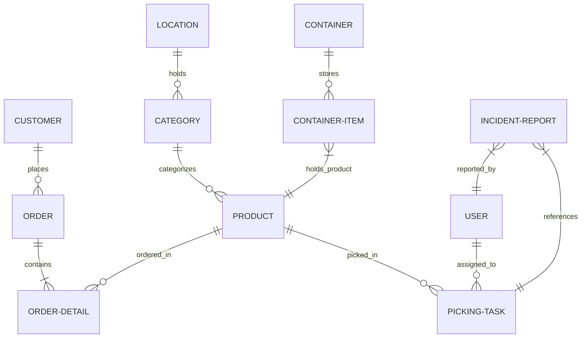

# 📘 CẨM NANG TÍCH HỢP API CHO NHÀ PHÁT TRIỂN FRONTEND
> **Dự án:** Hệ thống Quản lý Đơn hàng & Kho vận KingFoods (KingFoods Order & Picking WMS)  
> **Phiên bản:** 1.1.0 (Bản hoàn thiện theo Role)  
> **Cập nhật mới nhất:** Hôm nay

Tài liệu này được phân chia rõ ràng theo từng Vai trò (Role) nhằm hỗ trợ đội ngũ Frontend dễ dàng nắm bắt kiến trúc hệ thống, quyền hạn và cách tích hợp các API một cách trực quan, chính xác nhất.

---

## 🗺️ 1. SƠ ĐỒ QUAN HỆ BẢNG (DATABASE SCHEMA RELATIONSHIP)

Để xây dựng giao diện chính xác, Frontend cần hiểu rõ cách các thực thể liên kết chéo với nhau:



### 🔗 Giải thích liên kết dữ liệu & Vai trò:
1. **User (Staff / Admin):** Bảng `users`, có 2 vai trò chính: `staff` (Nhân viên kho) và `admin` (Quản lý kho tổng).
2. **Customer (Khách hàng đại diện Chi nhánh):** Bảng `customers`, thuộc một `Branch` (Chi nhánh). Đây là các tài khoản đăng nhập đặt hàng sỉ.
3. **Product $\rightarrow$ Category $\rightarrow$ Location:** Sản phẩm thuộc danh mục, danh mục thuộc vị trí. Khi tạo task, Server tự dò vị trí.
4. **PickingTask:** Nhiệm vụ nhặt hàng liên kết chéo tới `Order`, `Product` và `User`.
5. **Container & ContainerItem:** Thùng hàng và các sản phẩm bên trong do nhân viên đóng gói.

---

## 🔐 2. CƠ CHẾ XÁC THỰC (AUTHENTICATION FLOW)

Tất cả các API được bảo mật bằng cơ chế **Bearer Token JWT**.
- Frontend đính kèm Token vào Header: `Authorization: Bearer <Mã_Token>`

---

## 👨‍💼 PHẦN 1: DÀNH CHO CUSTOMER (QUẢN LÝ CHI NHÁNH / KHÁCH HÀNG SỈ)

**Vai trò:** Đặt hàng từ hệ thống kho tổng, theo dõi tình trạng đơn hàng của chi nhánh mình.

#### 1.1. Tạo đơn đặt hàng mới
* **Endpoint:** `POST /api/v1/client/orders`
* **Request Body:**
  ```json
  {
    "products": [
      { "productId": 1, "quantity": 5 },
      { "productId": 2, "quantity": 10 }
    ],
    "address": "123 Đường Song Hành, Quận 2, TP.HCM"
  }
  ```

#### 1.2. Xem danh sách toàn bộ đơn đã đặt
* **Endpoint:** `GET /api/v1/client/orders`
* **Ý nghĩa:** Trả về tất cả các đơn hàng thuộc về chi nhánh đang đăng nhập.

#### 1.3. Lọc danh sách đơn hàng theo trạng thái
* **Endpoint:** `GET /api/v1/client/orders/history/:status`
* **Path Parameter:** `:status` (`pending`, `processing`, `shipped`, `delivered`, `cancelled`)
* **Ví dụ:** `/api/v1/client/orders/history/pending`

#### 1.4. Cập nhật địa chỉ hoặc tự hủy đơn hàng
* **Endpoint:** `PATCH /api/v1/client/orders/:id`
* **Path Parameter:** `:id` (ID của đơn hàng)
* **Request Body:**
  ```json
  {
    "address": "Địa chỉ giao hàng mới (nếu muốn đổi)",
    "status": "cancelled" 
  }
  ```
  *(Lưu ý: Chỉ được hủy khi đơn hàng ở trạng thái `pending`).*

---

## 👷 PHẦN 2: DÀNH CHO STAFF (NHÂN VIÊN KHO)

**Vai trò:** Nhận nhiệm vụ từ Admin, đi nhặt hàng theo kệ, đóng thùng, báo cáo nếu kệ trống.

#### 2.1. Xem danh sách việc được giao trong ca
* **Endpoint:** `GET /api/v1/admin/picking/assigned`
* **Ý nghĩa:** Server tự nhận diện nhân viên qua Token và trả về danh sách task.
* **Ví dụ Data trả về:** Task ID, Order ID, Product Name, Số lượng cần nhặt, Vị trí Kệ hàng.

#### 2.2. Nhặt hàng & Đóng thùng (Pack)
* **Endpoint:** `POST /api/v1/admin/picking/pack`
* **Request Body:**
  ```json
  {
    "taskId": 101,
    "quantity": 5,
    "containerCode": "CONT-KINGFOOD-01"
  }
  ```

#### 2.3. Bàn giao nhiệm vụ dở dang cho ca sau (Handover)
* **Endpoint:** `POST /api/v1/admin/picking/handover`
* **Request Body:**
  ```json
  {
    "taskId": 101,
    "nextStaffId": 6
  }
  ```

#### 2.4. Di chuyển sản phẩm giữa các thùng (Move)
* **Endpoint:** `POST /api/v1/admin/picking/move`
* **Request Body:**
  ```json
  {
    "productId": 1,
    "oldContainerCode": "CONT-KINGFOOD-01",
    "newContainerCode": "CONT-KINGFOOD-02",
    "quantity": 2
  }
  ```

#### 2.5. Báo cáo kệ hàng bị trống (Incident Report)
* **Endpoint:** `POST /api/v1/admin/picking/incident`
* **Request Body:**
  ```json
  {
    "taskId": 101,
    "photoUrl": "https://storage.kingfoods.com/incidents/kecu-trong.jpg",
    "reason": "Kệ hết sạch hàng chưa kịp châm"
  }
  ```

---

## 👑 PHẦN 3: DÀNH CHO ADMIN (QUẢN LÝ KHO TỔNG)

**Vai trò:** Điều phối toàn bộ hoạt động kho, quản lý danh mục, hàng hóa, phân chia công việc, và truy vết lỗi.

### 📊 BẢNG PHÂN QUYỀN CRUD THỰC THỂ CHO ADMIN
Admin (Quản lý kho) có quyền thao tác trên hầu hết các dữ liệu cốt lõi, **ngoại trừ** các thông tin liên quan đến vận hành Chi nhánh và Quản lý Chi nhánh.

| Tên Thực thể (Entity) | Quyền hạn của Admin | Chi tiết các chức năng |
| :--- | :---: | :--- |
| **Product (Sản phẩm)** | 🟢 Toàn quyền | Xem, Thêm mới, Cập nhật thông tin, Xóa sản phẩm. |
| **Category (Danh mục)** | 🟢 Toàn quyền | Xem, Thêm mới, Cập nhật danh mục, Xóa danh mục. |
| **Location (Vị trí kho)** | 🟢 Toàn quyền | Xem, Cấu hình mới, Cập nhật, Xóa vị trí kệ kho. |
| **Order (Đơn hàng sỉ)** | 🟡 Xem & Cập nhật | Xem toàn bộ đơn hàng, Cập nhật trạng thái duyệt đơn. (Không tự xóa hay tự tạo đơn khách hàng). |
| **PickingTask (Nhiệm vụ)** | 🟢 Toàn quyền | Sinh task từ đơn hàng, Gán việc, Xóa/Hủy task, Sửa task. |
| **Container (Thùng hàng)** | 🟢 Toàn quyền | Tạo mã thùng mới, Kiểm tra, Xóa thùng. |
| **Incident (Sự cố)** | 🟢 Toàn quyền | Xem báo cáo trống kệ, Cập nhật trạng thái đã giải quyết. |
| 🚫 **Customer (Quản lý cửa hàng)**| 🔴 Không có quyền | Thuộc phân hệ kinh doanh/nhân sự, Admin kho không thao tác. |
| 🚫 **Branch (Chi nhánh)** | 🔴 Không có quyền | Thuộc phân hệ kinh doanh hệ thống, Admin kho không thao tác. |

### 🛠️ DANH SÁCH API CỦA ADMIN

#### 3.1. Xem danh sách toàn bộ đơn hàng
* **Endpoint:** `GET /api/v1/admin/orders`
* **Query Parameter:** `?status=pending` (Để lọc các đơn chờ duyệt).

#### 3.2. Cập nhật trạng thái đơn hàng (Duyệt đơn, Xuất kho)
* **Endpoint:** `PATCH /api/v1/admin/orders/:id`
* **Request Body:**
  ```json
  {
    "status": "processing" 
  }
  ```

#### 3.3. Phân chia đơn hàng thành các nhiệm vụ nhặt (Assign Tasks)
* **Endpoint:** `POST /api/v1/admin/picking/assign`
* **Ý nghĩa:** Cắt nhỏ đơn hàng giao cho nhiều nhân viên. Không cần truyền vị trí kệ, Server tự dò.
* **Request Body:**
  ```json
  {
    "orderId": 14,
    "tasks": [
      { "productId": 1, "staffId": 5, "quantity": 5 },
      { "productId": 2, "staffId": 6, "quantity": 10 }
    ]
  }
  ```

#### 3.4. Truy xuất nguồn gốc thùng hàng (Traceability)
* **Endpoint:** `GET /api/v1/admin/picking/trace/:containerCode`
* **Ý nghĩa:** Kiểm tra bên trong thùng có gì, thuộc đơn nào và **ai là người đóng gói sản phẩm đó**. Trả về định danh đầy đủ của Staff đã pack hàng.

#### 3.5. Ghi nhận hàng lỗi & Truy quét người chịu phạt (Issue Report)
* **Endpoint:** `POST /api/v1/admin/picking/issue/:itemId`
* **Path Parameter:** `:itemId` (ID của dòng hàng lỗi lấy từ API Traceability ở trên).
* **Request Body:**
  ```json
  {
    "status": "damaged" 
  }
  ```
* **Phản hồi:** Cập nhật trạng thái sản phẩm là hỏng/mất và trả về ngay số điện thoại, tên nhân viên chịu trách nhiệm để phạt hành chính.

#### 3.6. Quản lý sự cố kệ trống (Incidents)
* **Xem danh sách:** `GET /api/v1/admin/picking/incidents` (Lấy các kệ đang báo trống).
* **Đánh dấu đã xử lý/Châm kệ xong:** `POST /api/v1/admin/picking/incident/:id/resolve` (Để nhân viên nhặt hàng tiếp).

---

## 💡 MỘT SỐ LƯU Ý KHI LÀM FRONTEND (UX/UI)
1. **Interceptor:** Tự động bắt lỗi `401 Unauthorized` để đẩy về trang Đăng nhập.
2. **Phân quyền Route:** Khóa các trang dựa trên `role` (`admin`, `staff`, `customer`).
3. **Quét Mã vạch (Scanner):** Khuyến khích tích hợp Camera Scanner cho `staff` quét `containerCode` để tốc độ làm việc nhanh hơn 300%.
